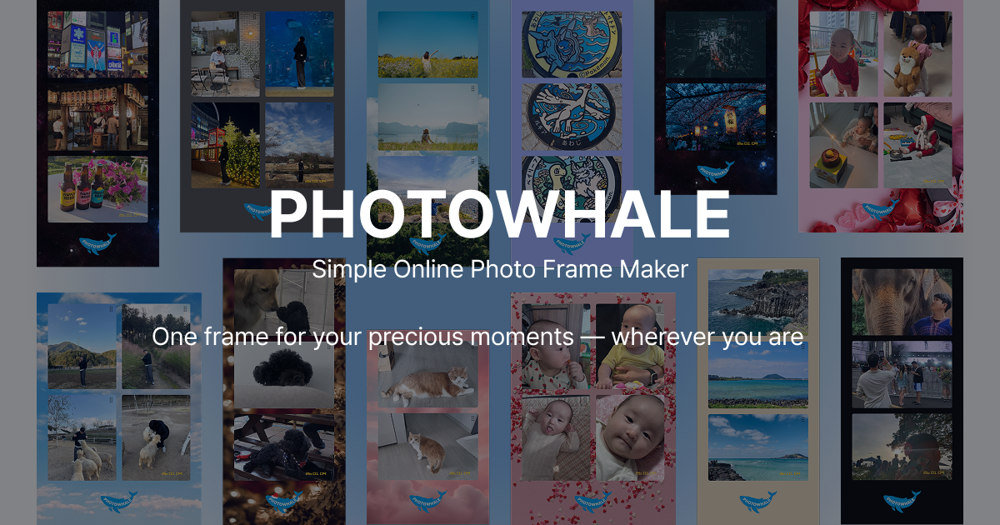
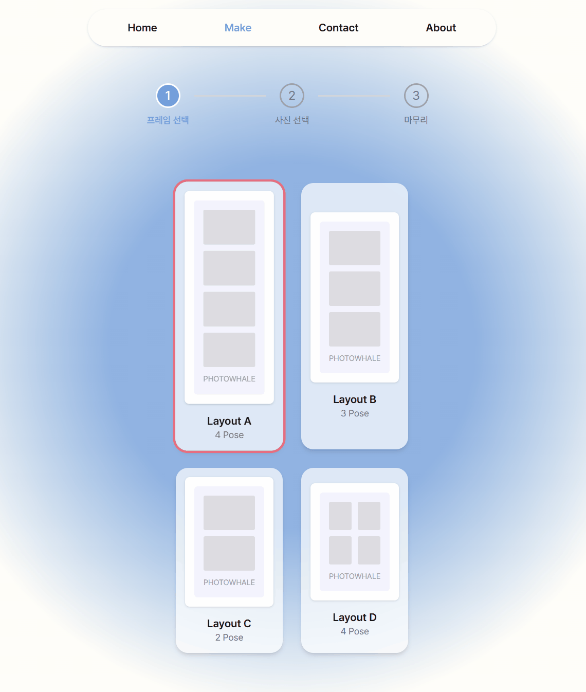
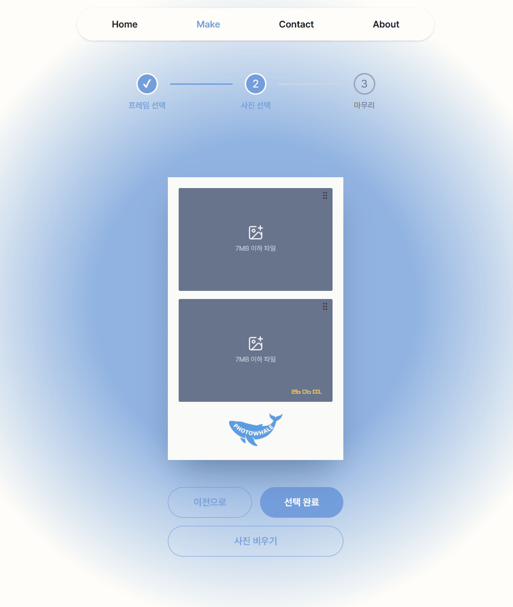

# 🐳 PHOTOWHALE

> 

Simple Online Photo Frame Maker

언제 어디서나 당신의 귀중한 순간을 프레임에 담아보세요.

<h3 align='center'>🔗 <a link href='https://photowhale.vercel.app'>PHOTOWHALE</a></h3>

## 🛠️ Tech Stack

**Core**

- Next.js, TypeScript, Vite

**UI / Styling**

- Tailwind CSS, shadcn/ui

**State Management**

- Zustand

**Libraries**

- Swiper.js, Framer Motion, dnd-kit
- html-to-image, libheif-js
- EmailJS, react-toastify

## 👨‍💻 Developer

<table>
  <tr>
    <td colspan="2" align="center"><b>FE</b></td>
  </tr>
  <tr>
    <td align="center"><b>이윤환</b></td>
    <td align="center"><b>손성오</b></td>
  </tr>
  <tr>
    <td align="center"><a href="https://github.com/unanbb"> @unanbb</a></td>
    <td align="center"><a href="https://github.com/Sonseongoh"> @Sonseongoh</a></td>
  </tr>
</table>

## 🤷 How To Use

1️⃣ 프레임 선택

- 추억을 담을 프레임을 선택하세요.

  

2️⃣ 사진 선택

- 귀중한 순간들을 선택하세요.
- 드래그 앤 드랍을 통해 이미지의 순서를 변경할 수 있습니다.

  

3️⃣ 프레임 꾸미기

- 프레임 색상/스킨 및 필터를 선택하여 나만의 프레임을 만들어 보세요.

  
